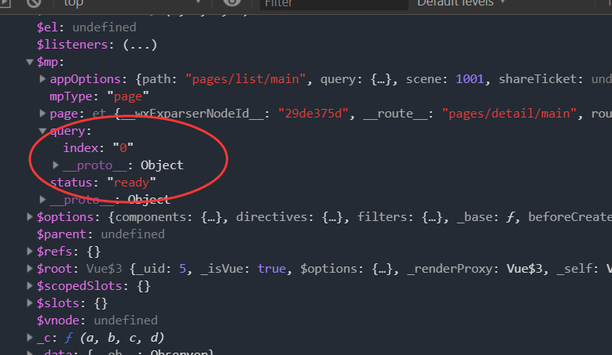
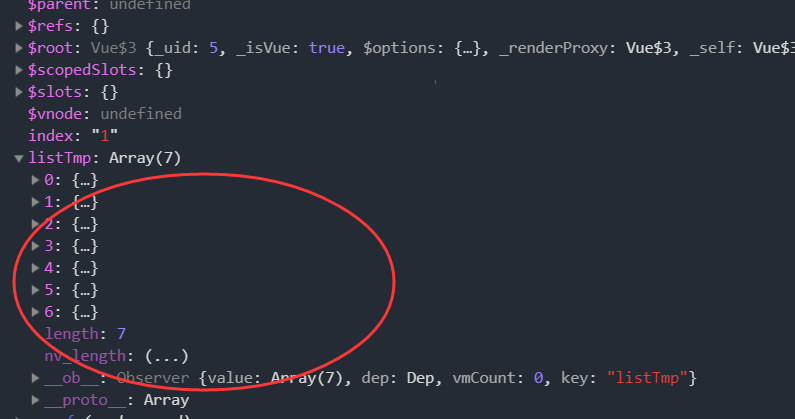

根据List页面点击跳转

这个的绑定是在list_template中进行的

在list_template中

```vue
<div @tap="toDetail" class="tmpContainer">
```

```vue
<script>
  export  default {
    props:[
      'item','index'
    ],
    methods:{
      toDetail(){
        //跳转到详情页+传参进去+因此需要传参，参数为index,在props中进行传递
        wx.navigateTo(
          {
            url:'/pages/detail/main?index='+this.index
          })
      }
    }}
</script>
```


在detail.vue中

可以使用this

组件实例对象



现在的数据在list-data.js中

即数据在vuex中

在detail.vue中

```vue
import {mapState} from 'vuex'
```

```vue
mounted(){
    console.log(this);
},
  computed:{
    ...mapState(['listTmp'])
  }
```

即看到



至此数据导入部分全部完成，现在需要进行的是h5编写

