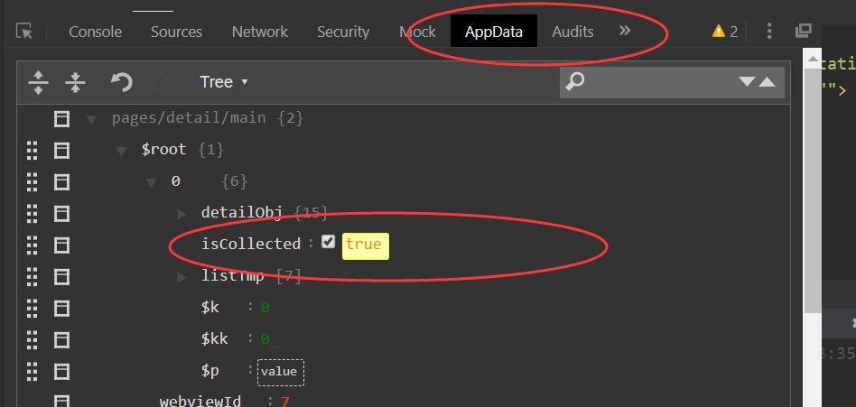

在detail.vue中

```vue
data(){
  return{
    detailObj:{},
    isCollected:false //标识该文档是否被收藏
  }
```



进行状态切换，观测切换前后的变化

```

```

```vue
methods:{
  handleCollection(){
    let isCollected=!this.isCollected;
    this.isCollected=isCollected;
    let title =isCollected?"收藏成功":"取消收藏";
    wx.showToast({
      title,
      icon:'success'
    })
  }
}
```

将数据缓存到本地

```vue
//读取之前本地缓存的状态查看是否被收藏
 let oldStorage=wx.getStorageSync('isCollected')
oldStorage=[this.index]=isCollected;

//将本次设置的结果缓存到本地
wx.setStorage({
  key:'isCollected',
  data:oldStorage
})
```

当什么状态都没有的时候

isCollected是null的

因此在beforeMount地方进行预处理

```vue
beforeMount(){
  console.log(this);
  // 使用this.$mp.query.index取代 onLoad中的options
  this.index =this.$mp.query.index
  //预处理，查看本地是否收藏的缓存
  let oldStorage=wx.getStorageSync('isCollected')
  if (!oldStorage)//说明用户没有点击过
  {
    wx.setStorage({
      key:'isCollected',
      data:{}
    })
  }else{
    //用户有缓存
    //需要根据本地缓存，修改收藏的位置的值(上面给的是{}即可能状态为undefined)
    this.isCaollected=(oldStorage[this.index]?true:false)
  }
},
```