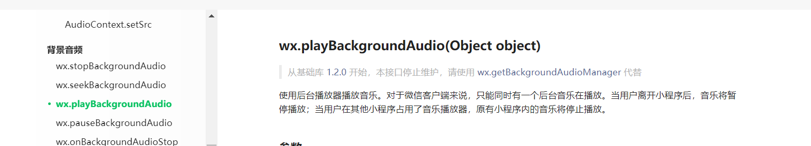
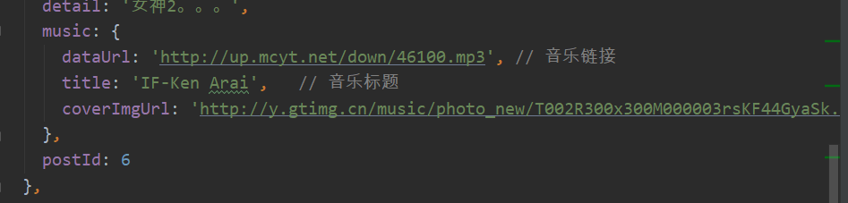

# 音乐播放代码

注意数据的传递detailObj中有list-data的传入

```vue
  computed:{
    ...mapState(['listTmp'])
  },
```

```vue
this.detailObj=this.listTmp[this.$mp.query.index];
```



```vue
let {dataUrl,title}=this.detailObj.music
```



在detail.vue中

```vue

```

```vue
data(){
  return{
    detailObj:{},
    isCollected:false, //标识该文档是否被收藏
    isMusicPlay:false //标识音乐是否被播放
  }
```

```vue
handleMusicPlay(){
  let isMusicPlay=!this.isMusicPlay;
  this.isMusicPlay=isMusicPlay;
  let {dataUrl,title}=this.detailObj.music
  if(isMusicPlay) {
    wx.playBackgroundAudio({
      dataUrl,
      title,
    });
  }
  else {
    wx.pauseBackgroundAudio()
  }
}
```

# 在播放音乐后，还需要对于音乐进行监听

之前的监听在onload中进行，使用vue开发则在beforeMount中进行

使用的是wx.onBackgroundAudioPlay(function callback)

wx.onBackgroundAudioPause(function callback)

callback的写法（）=>{}

```vue
//对于音乐状态进行监听
  wx.onBackgroundAudioPlay(()=>{
    console.log("音乐播放");
    this.isMusicPlay=true;
  })
  wx.onBackgroundAudioPause(()=>{
    console.log("音乐暂停");
    this.isMusicPlay=false;
  })
}
```

需要指定哪个音乐被播放，即指定存index和状态

在datas中创建isPlay.js文件

```js
export default {
  pageIndex: null,  // 标识页面的下标
  isPlay: false     // 标识页面音乐是否在播放
}
```

在detail.vue中

```vue
import isPlayObj from '../../datas/isPlay'
```

# 需要判断进入页面的时候页面是在播放还是未播放状态

```vue
//并非进行的是判断，而是直接的状态设置
isPlayObj.pageIndex===this.index&&isPlayObj.isPlay?this.isMusicPlay=true:this.isMusicPlay=false
```