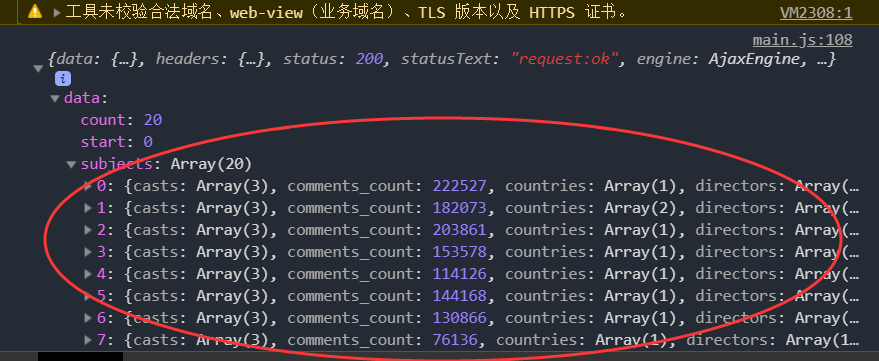

发送ajax请求

在store的main.js中

```
import Fly from 'flyio/dist/npm/wx'
```

```
// // 将store对象放置Vue的原型上，为的是每个实例都可以使用
Vue.prototype.$store = store
//
let fly = new Fly
Vue.prototype.$fly = fly
```

在movies的movies.vue中

```vue
<script>
  const MOVIE_URL = 'http://t.yushu.im/v2/movie/top250';
  export default{
    beforeMount(){
      //axios
      this.$fly.get(MOVIE_URL)
        .then(function (response) {
          console.log(response);
        })
        .catch(function (error) {
          console.log(error);
        });
    }
  }
  </script>
```



```vue
beforeMount(){
  //axios
  this.$fly.get(MOVIE_URL)
    .then(function (response) {
      console.log(response);
      let moviesArr=response.data.subjects;
      //在这种情况下，this指代的是promise函数的实例
      this.moviesArr=moviesArr;
    })
    .catch(function (error) {
      console.log(error);
    });
}
```

需要更改为：

```
beforeMount(){
  //axios
  this.$fly.get(MOVIE_URL)
    .then ((response)=> {
      console.log(response);
      let moviesArr=response.data.subjects;
      //在这种情况下，this指代的是
      this.moviesArr=moviesArr;
    })
    .catch((error)=>{
      console.log(error);
    });
}
```

```
white-space: nowrap;
overflow: hidden;
text-overflow: ellipsis;
```

不换行

不够显示的用…显示