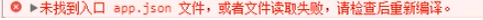
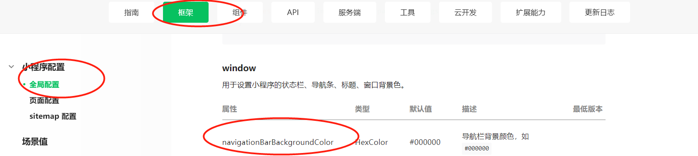

# 1.新建文件夹src下的app.vue

主要存放的是公共样式和公共js

```jsp
<script>
  export default {
  }
</script>

<style>
/*公共样式*/
</style>
```

# 2.新建入口文件main.js

```js
//引入vue
import Vue from 'vue'
//引入当前的app
import App from './app.vue'

// 设置vue的提示功能关闭
Vue.config.productionTip = false;

// 声明当前组件的类型
App.mpType = 'app' // 应用

// 生成应用的实例
const app = new Vue(App)

// 挂载整个应用，使得整个应用生效
app.$mount()
```

# 3.新建src/pages/index/index.vue

```jsp
<template>
    <div>
      <p>开启小程序之旅</p>
    </div>
</template>
<script>
  export default {
    data() {
      return {}
    }
  }
</script>
<style>
</style>
```

# 4.新建src/pages/index/main.js

```js
import Vue from 'vue'
import Index from './index.vue'

const index = new Vue(Index)

// 挂载当前的页面
index.$mount()

```


编译之后发现找不到对应的目录



缺少了app.json

因此在src下新增app.json的配置文件

```json
{
  "pages": [
    "pages/index/main"
    ]
}
```


# 5.对于窗口进行配置

在https://developers.weixin.qq.com/miniprogram/dev/reference/configuration/app.html微信小程序开发文档中-框架-小程序配置-全局配置-window //这就是小程序页面的配置



在src/pages/index/main.json中

```
{
  "navigationBarBackgroundColor": "#8ed145",
  "navigationBarTitleText": "今天也要加油鸭"
}
```

