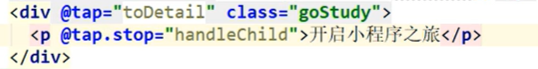

# 冒泡事件

bindtap

catchtap

```vue
<div @tap="toDetail" class="goStudy">
```

|-Script

  |-data

  |-beforeMount

  |-data

```js
toDetail(){
        // console.log('toDetail');
        wx.switchTab({
          url: '/pages/list/main'
        })
      }
```


**子元素一点**冒泡到父元素上，怎样能够阻止这样的事情发生？

vue中怎么样阻止冒泡，利用事件修饰符.stop



点击父元素的div显示的是toDetail

点里面只会触发child

# src/pages/list/main.js编写

```js
import Vue from 'vue'
import List from './list.vue'

//生成一个实例
const list = new Vue(List)

//挂载当前页面
list.$mount()
```

# src/pages/list/list.vue编写

```vue
<template>
  <div>
    list页面
  </div>
</template>

<script>
  export  default {

  }
</script>

<style>

</style>

```

同时，注意app.json

```json
{
"pages": [
"pages/index/main",
 "pages/list/main"
],
  "window": {
    "navigationBarBackgroundColor": "#8ed145"
}
}
```

注意需要npm start才会生成新页面

