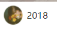

**文档包含List_template的创建使用**

由于各个页面的导航栏颜色相同

因此配置放在app.json中

```json
  "window": {
    "navigationBarBackgroundColor": "#8ed145"
}
```

针对需要复用的组件，新建list_template

1.创建pages/list_template文件夹

新建vue模板文件list_template.vue和main.js

```vue
<template>
  <div>
    list模板
  </div>
</template>

<script>
  export  default {
  }
</script>

<style>

</style>
```

main文件为空


2.在pages/list.vue中

```vue
<template>
<div>
    <ListTem/>
    </div>
</template>
<script>
    //引入模板
  import  ListTem from '../list_template/list_template.vue'
  export  default {
      //注册组件
    components:{ListTem}
  }
</script>
```


针对模板的操作

```css
.tmpContainer {
  display: flex;
  flex-direction: column;
  border-bottom: 1rpx solid #eee;
}
```

这个就是针对下边距，就是所有的模块的

```css
vertical-align: middle;
```

这样能让图片文字对齐

```css
.avatar_date{
  padding:10rpx;
}
```

这样是设置上下边距的



```css
.avatar_date img {
  width: 60rpx;
  height: 60rpx;
  vertical-align: middle;
  margin-right: 10rpx;
}
```


这个就是margin-right的作用

```css
.detail_img {
  width: 100%;
  height: 460rpx;
}
```


这样就又填充满了

```css
.content {
  font-size: 32rpx;
  text-indent: 32rpx;
  line-height: 50rpx;
  letter-spacing: 3rpx;
}
```


缩进：text-indent

行高（行间距）：line-height 

文字和文字之间的距离：letter-spacing

word-spacing是单词，只对单词生效

```
.view_star_container span{
  font-size: 28rpx;
  color: #333;
  margin-left: 10rpx;
}
```

margin-left在一个div下都是相对于上一个元素的左间距

margin-left