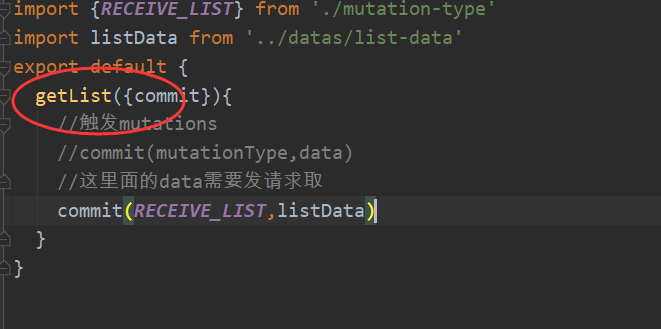

# 一、vuex里面都有些什么内容？

**Talk is cheap,Show me the code.** 先来一段代码间隔下这么多的文字：

```jsx
const store = new Vuex.Store({
 state: {
 name: 'weish',
 age: 22
 },
 getters: {
 personInfo(state) {
 return `My name is ${state.name}, I am ${state.age}`;
 }
 }
 mutations: {
 SET_AGE(state, age) {
 commit(age, age);
 }
 },
 actions: {
 nameAsyn({commit}) {
 setTimeout(() => {
 commit('SET_AGE', 18);
 }, 1000);
 }
 },
 modules: {
 a: modulesA
 }
}
```


**state**：存储状态。也就是变量；

**getters**：派生状态。也就是set、get中的get，有两个可选参数：state、getters分别可以获取state中的变量和其他的getters。外部调用方式：**store.getters.personInfo()**。就和vue的computed差不多；

**mutations**：提交状态修改。也就是set、get中的set，这是vuex中唯一修改state的方式，但不支持异步操作。第一个参数默认是state。外部调用方式：

**store.commit('SET_AGE', 18)**。和vue中的methods类似。

**actions**：和mutations类似。不过actions支持异步操作。第一个参数默认是和store具有相同参数属性的对象。外部调用方式：**store.dispatch('nameAsyn')**。

**modules**：store的子模块，内容就相当于是store的一个实例。调用方式和前面介绍的相似，只是要加上当前子模块名，如：**store.a.getters.xxx()**。

# 二、实际代码？

store.js

```js
import Vue from 'vue'
import Vuex from 'vuex'
import store from './stroe'
import state from './state'
import actions from './actions'
import mutations from './mutations'
import getters from './getter'

// 声明使用vuex
Vue.use(Vuex)

//vue最核心的Store对象，需要暴露接口
export default new Vuex.Store({
  state,
  actions,
  getters,
  mutations
})
```

**state.js**

```js
export default {
  listTmp:[]
}
```

actions.js

```
export default {
  getList({commit}){
    //触发mutations
  }
}
```


注意在actions和mutation中的mutation

为了防止mutation-type出现问题


**在mutation_type.js中**

```js
export const RECEIVE_LIST='receive_list'
```

actions.js中需要的data现在假设是datas里面的list-data.js中的数组

而list-data.js中list_data才是数组

```js
import {RECEIVE_LIST} from './mutation-type'

export default {
  [RECEIVE_LIST](state, {list_data}){
    state.listTmp = list_data
    console.log(state);
  }
}
```

**最终actions.js成为**

```js
import {RECEIVE_LIST} from './mutation-type'
import listData from '../datas/list-data'
export default {
  getList({commit}){
    //触发mutations
    //commit(mutationType,data)
    //这里面的data需要发请求取
    commit(RECEIVE_LIST,listData)
  }
}
```


在list.vue中

store.js管理存储数据

其中state.js中 的listTmp不是我们想要的

那么需要的数据是通过action.js触发mutation.js得到的


在list.vue中

```js
export  default {
    components:{ListTmp},
    //需要分发一次action
    beforeMount(){
      //dispatch中的参数为分发的action对应参数
      this.$store.dispatch('getList')
    }
  }
```

其中的对应参数取决于action.js



映射组件到前端，使用的是vuex中的mapState

```js
import  {mapState} from 'vuex'
compunted:{
      //映射状态到本组件
      ...mapState(['listTmp'])
    }
```


怎样调试：actions.js ->mutations.js

分别两个里面console不同的内容


剩下的就是list.vue中h5编写

```
<ListTmp v-for="(item,index) in listTmp" :key="index" :item="item" :index="index"/>
```


list.vue中内容传入list_template.vue中

编写list_template


```vue
<script>
  export  default {
    props:[
      'item','index'
    ]
  }
</script>
```